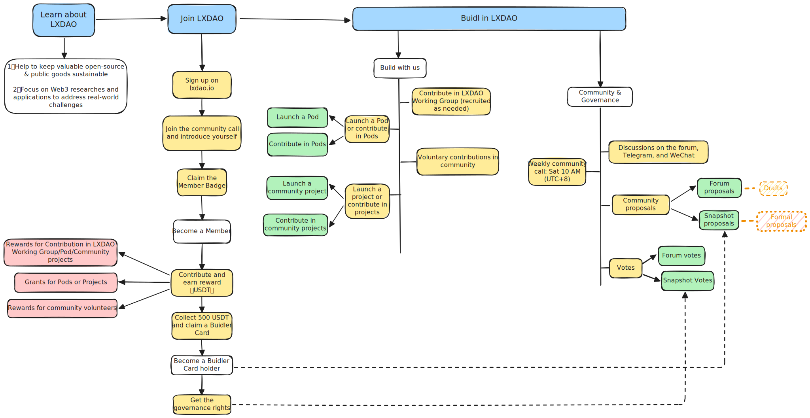

    

    <h1>GM, Welcome to LXDAO Web3 Developer Community 👋</h1>

LXDAO is an R&D-driven DAO building an Infinite Cycle to help sustain open-source projects and public goods.

    <a href="./README.mdx" target="_blank">
    English
    </a>
    &nbsp;|&nbsp;
    <a href="./README_zh-CN.mdx" target="_blank">
    简体中文
    </a>

## 🏢 About LXDAO

**🌈 Our Mission:** To create a sustainable, ever-renewing cycle that supports open-source projects and public goods by uniting exceptional Web3 talent and technology.

**🏁 Implementation:** Operating as a DAO (Decentralized Autonomous Organization) to enable members to realize their ideas using community and treasury resources in an open, transparent, and equitable environment.

**👥 Join Us:** Open to all contributors. Your influence grows through meaningful contributions to the ecosystem.

[**Join Community 👉**](https://lxdao.io/onboarding/intro)

    

## 🚀 LX BuildPath

LX BuildPath is our core R&D framework that addresses open-source sustainability challenges through a cyclical system of talent development, project implementation, and incentive distribution.

| Project | Description | Progress |
|------------|-------------|------|
| <a href="https://github.com/IntensiveCoLearning" target="_blank">📚 IntensiveCoLearning</a> | Let more people learn the technologies they need. | `50%` |
| <a href="https://github.com/lxdao-official/WhatToBuild" target="_blank">💡 WhatToBuild</a> | Analyze, research, and organize application ideas to inspire everyone's creativity and avoid reinventing basic wheels. | `10%` |
| <a href="https://github.com/Casual-Hackathon" target="_blank">🎮 CasualHackathon</a> | Casual hackathon, no prize pool, no PR, returning to pure hackathon, letting everyone brainstorm and quickly create demos and MVPs. [Learn more 👉](https://forum.lxdao.io/t/the-introduction-of-casual-hackathon/2827) | `10%` |
| <a href="https://fairsharing.xyz" target="_blank">🤝 FairSharing</a> | Record contributions and collaborate together, allowing everyone to work asynchronously, distribute fairly, and contribute persistently. | `70%` |
| <a href="#" target="_blank">🏆 RetroFunding</a> | Retroactive rewards, selecting projects that work seriously and produce results, adding additional and continuous incentives. | `0%` |

## 🏗️ About LXDAO Pods

Pods are LXDAO’s agile, lightweight, self-organizing working groups. They supply funding, resources, and guidance to promising projects, helping them grow into successful initiatives. [Pod Working Group Overview 👉](https://www.notion.so/lxdao/Pod-1eadceffe40b804ea6fdf7a29f4edd4c)

Recently Active Pods:

<table align="center">
  <tr>
    <td align="center" valign="middle"></td>
    <td align="center" valign="middle"></td>
    <td align="center" valign="middle"></td>
    <td align="center" valign="middle"></td>
    <td align="center" valign="middle"></td>
    <td align="center" valign="middle"></td>
  </tr>
</table>

## 📚 About LXDAO Projects

Projects in LXDAO are larger and more mature than Pods. Each project comes with a complete proposal that has been approved by a DAO vote, and we are committed to maintaining these projects for the long term.

Recently Active Projects:

<table align="center">
  <tr>
    <td align="center" valign="middle"></td>
    <td align="center" valign="middle"></td>
    <td align="center" valign="middle"></td>
    <td align="center" valign="middle"></td>
    <td align="center" valign="middle"></td>
    <td align="center" valign="middle"></td>
  </tr>
</table>
